# 基于Springboot的教学资源库

## Springboot-0056


## 技术栈

Springboot mybatisplus vue mysql maven


## 数据库表(17张)


## 功能介绍

```properties
管理员：管理员登陆后可对系统进行全面管理，管理员主要功能模块包括个人中心、教师管理、学生管理、课程信息管理、课程作业管理、学生选课管理、学生作业管理、学生成绩管理、系统管理，管理员实现了对系统信息的查看、添加、修改和删除的功能。

学生：学生进入本教学资源库系统的设计与实现前台可查看系统信息，包括首页、课程信息、课程作业、试卷列表、公告信息等，注册登录后主要功能模块包括个人中心、考试记录、错题本、学生选课管理、学生作业管理、学生成绩管理和我的收藏管理。

教师：教师注册登录后主要实现的功能模块包括个人中心、课程信息管理、课程作业管理、学生选课管理、学生作业管理、学生成绩管理、试卷管理、试题管理、考试管理。
```


## 图片

### 前台

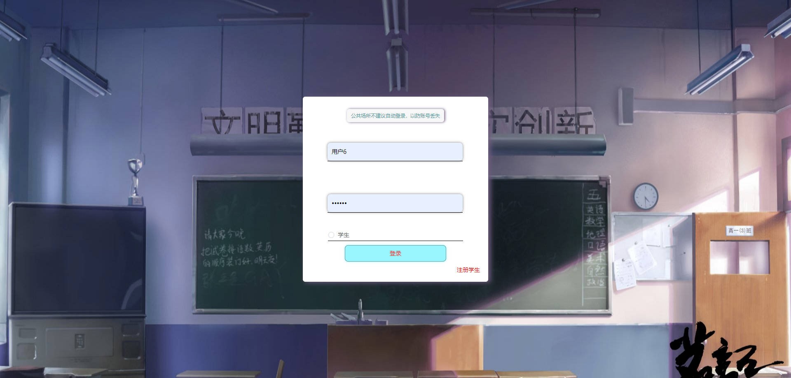

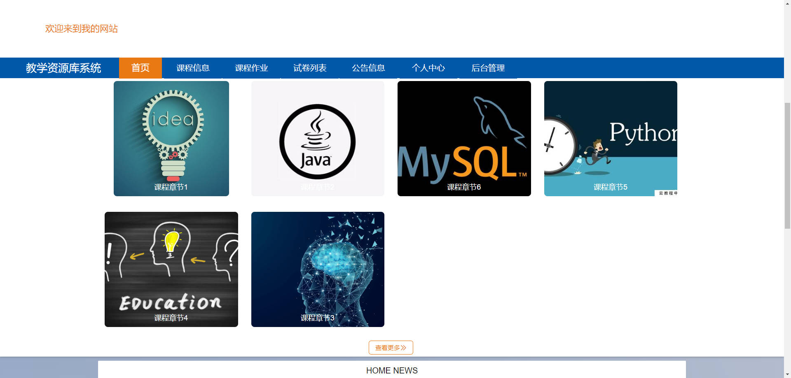


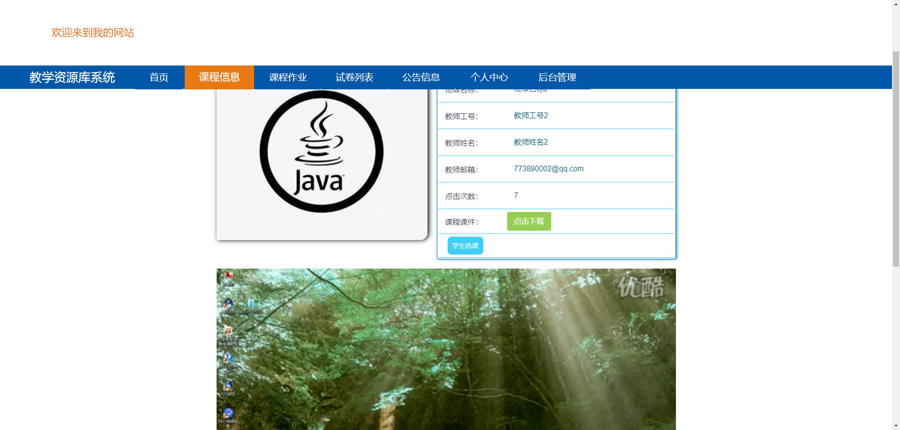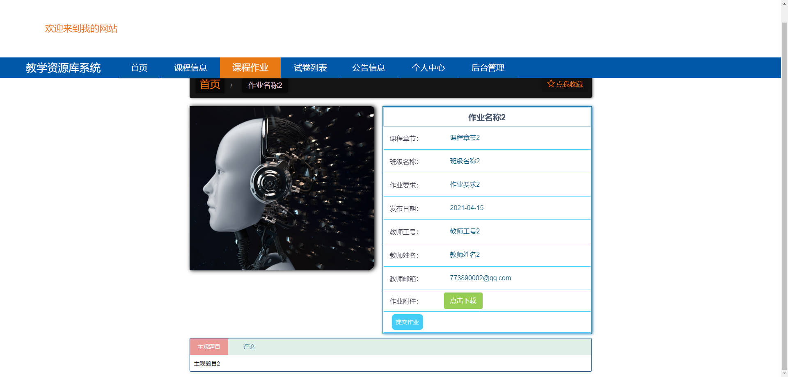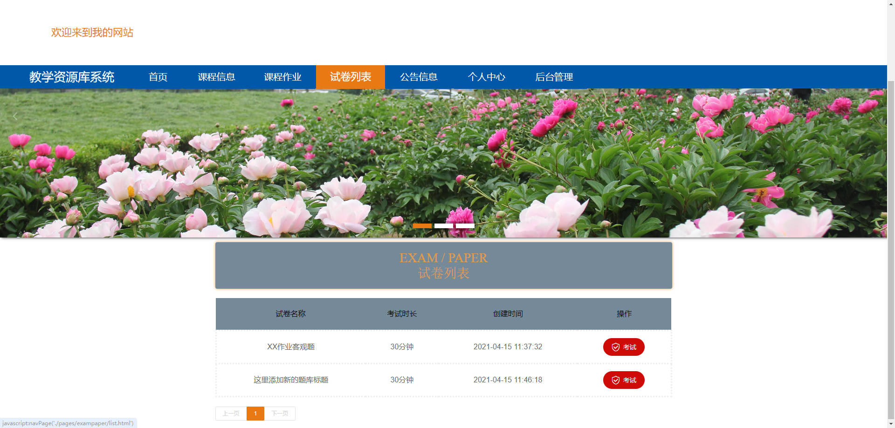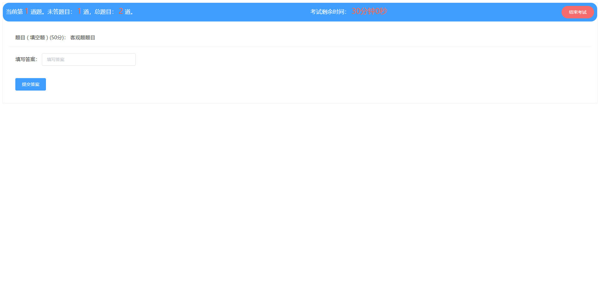

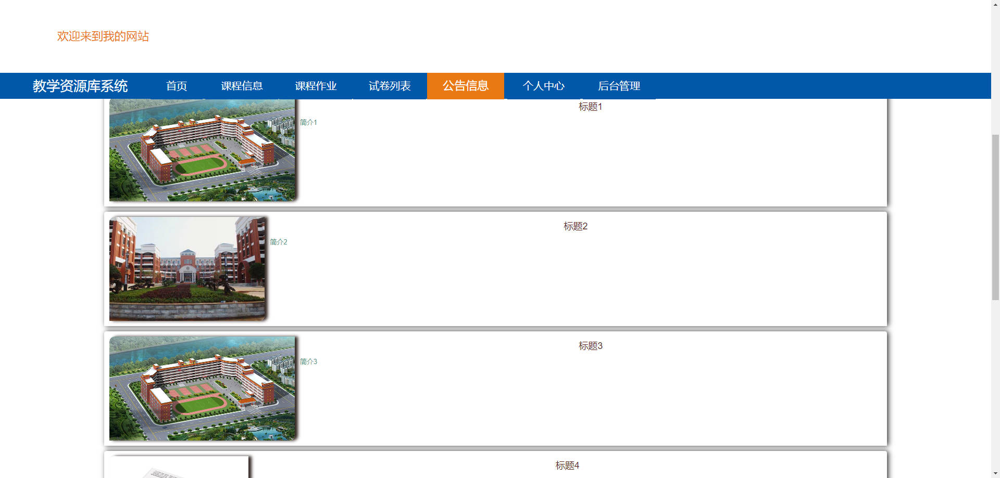

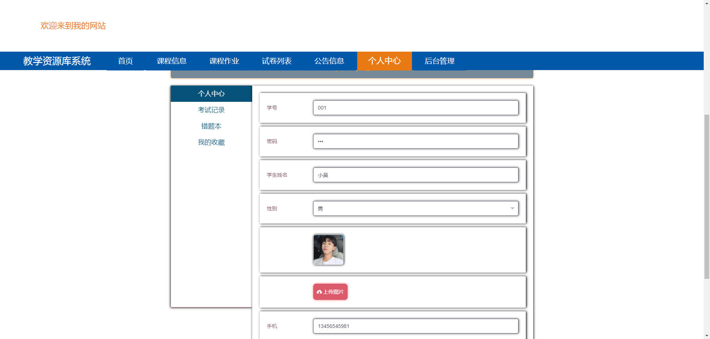

### 后台


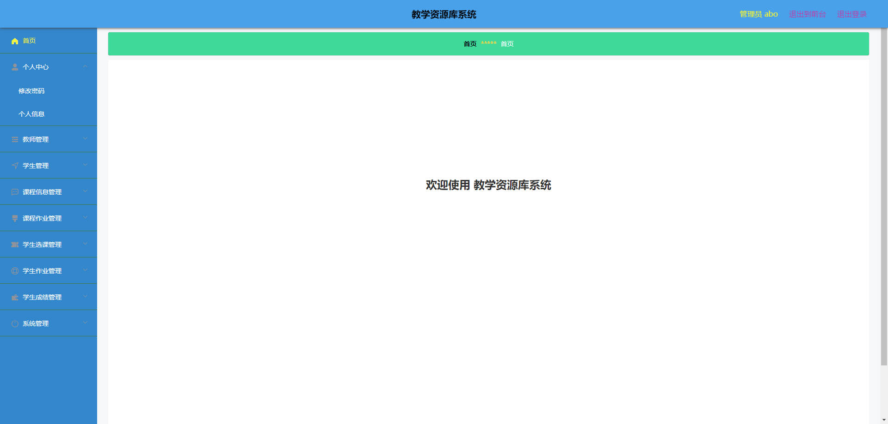

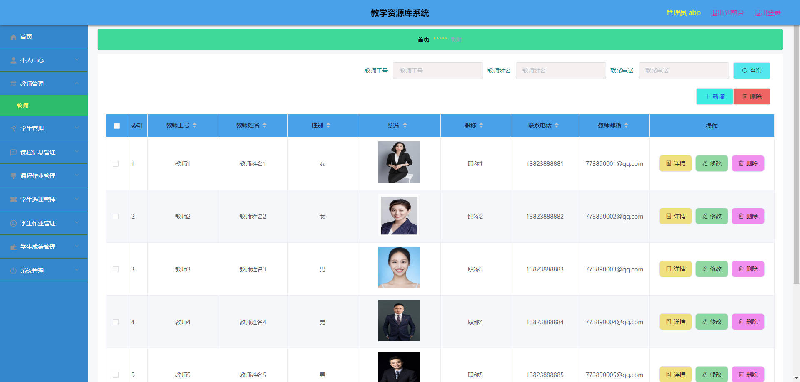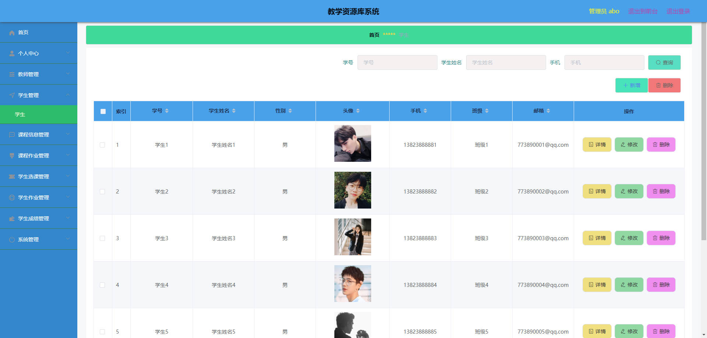

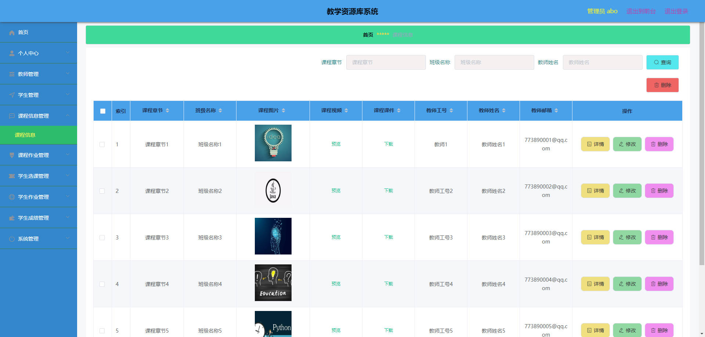

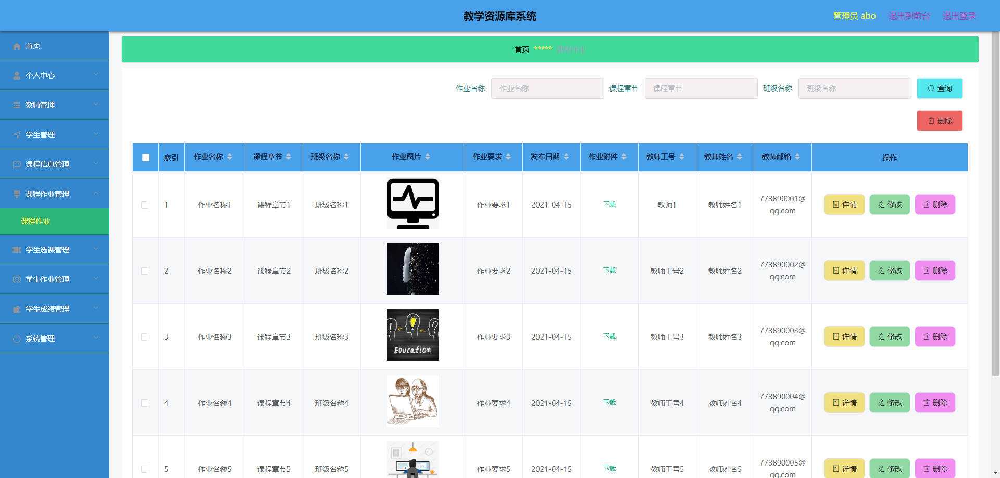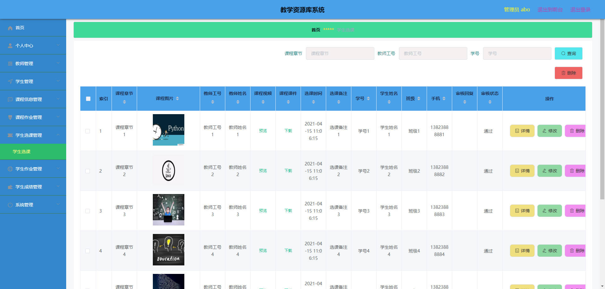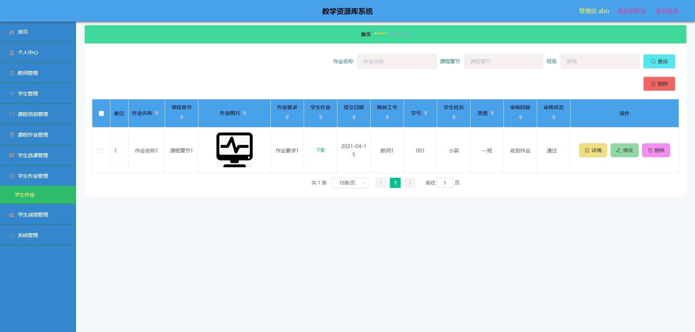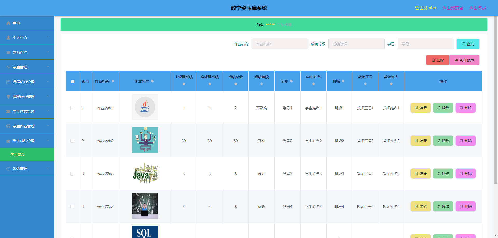


## 访问路径

### 前台

```properties
http://localhost:8080/springboot60a0e/front/pages/login/login.html

账号 001
密码 001
```

### 后台

```properties
http://localhost:8080/springboot60a0e/admin/dist/index.html#/login

账号 abo
密码 abo
```


## 功能图

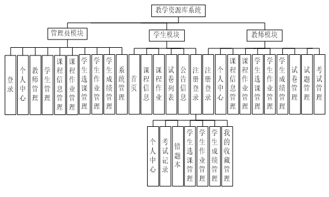


## 文档目录

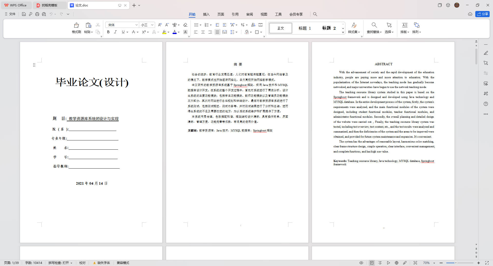


## 打赏或交流


